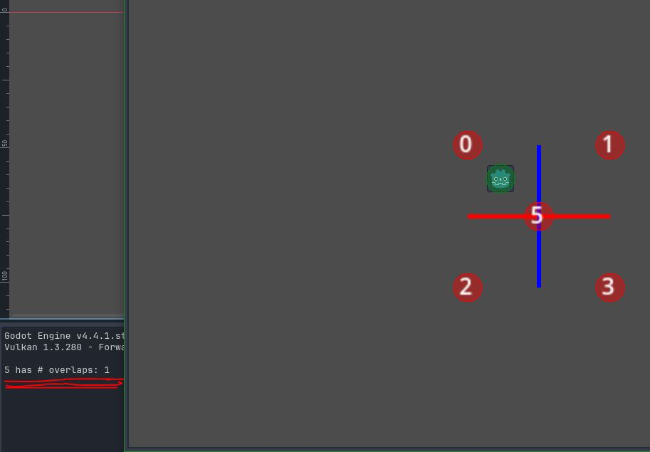

# Setup

Use left-click to place a CharacterBody2d.
All Area2D will print each frame if they have a collision with the CharacterBody2d.
Even if there is no collision the Area2D which contains the origin will report a collision for a single frame (this always happens as long as the Area2D contains the origin!)

# Control
Leftclick : Place CharacterBody2d
Rightclick : Delete CharacterBody2d
